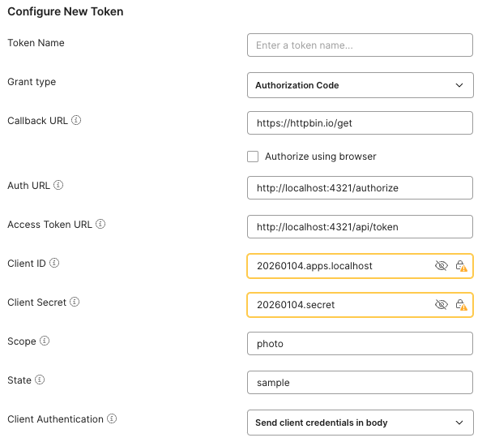

# OAuthBin

A complete OAuth 2.0 server ready to use in a Docker container. Ideal for development, testing, and prototyping applications that require OAuth authentication.

## 🚀 Quick Start

```bash
docker run -p 4321:4321 jondotsoy/oauthbin
```

The server will be available at `http://localhost:4321`

## 🔑 Default Credentials

The container includes a pre-configured OAuth client:

- **Client ID**: `20260104.apps.localhost`
- **Client Secret**: `20260104.secret`
- **Redirect URI**: Any URL (configurable per request)

## 📋 Features

- ✅ Complete OAuth 2.0 with multiple authentication flows
- ✅ Authorization Code Flow (with and without PKCE)
- ✅ Implicit Flow
- ✅ Password Credentials Flow
- ✅ Client Credentials Flow
- ✅ Refresh Token Flow
- ✅ Prometheus metrics at `/api/metric`
- ✅ No configuration required

## 🔧 Usage with Docker Compose

```yaml
services:
  oauth-provider:
    image: jondotsoy/oauthbin
    ports:
      - "4321:4321"
```

## 🔧 Postman Configuration

You can easily test OAuthBin using Postman with the Authorization Code flow:



**Configuration steps:**

1. Create a new request in Postman
2. Go to the **Authorization** tab
3. Select **OAuth 2.0** as the type
4. Click **Configure New Token** and use these values:
   - **Grant type**: Authorization Code
   - **Callback URL**: `https://httpbin.io/get`
   - **Auth URL**: `http://localhost:4321/authorize`
   - **Access Token URL**: `http://localhost:4321/api/token`
   - **Client ID**: `20260104.apps.localhost`
   - **Client Secret**: `20260104.secret`
   - **Scope**: `photo`
   - **State**: `sample` (or any value)
   - **Client Authentication**: Send client credentials in body

5. Click **Get New Access Token**
6. Complete the authorization in the browser
7. Use the generated token in your requests

## 📚 Usage Examples

### Authorization Code Flow

**1. Get authorization code:**
```bash
curl "http://localhost:4321/authorize?response_type=code&client_id=20260104.apps.localhost&redirect_uri=https://httpbin.io/get&scope=photo&state=xyz"
```

**2. Complete authorization:**
```bash
curl -X POST http://localhost:4321/api/complete_authorize \
  -H "Content-Type: application/x-www-form-urlencoded" \
  -d "client_id=20260104.apps.localhost&redirect_uri=https://httpbin.io/get&scope=photo"
```

**3. Exchange code for token:**
```bash
curl -X POST http://localhost:4321/api/token \
  -H "Content-Type: application/x-www-form-urlencoded" \
  -d "grant_type=authorization_code&code=YOUR_CODE&redirect_uri=https://httpbin.io/get&client_id=20260104.apps.localhost&client_secret=20260104.secret"
```

### Client Credentials Flow

```bash
curl -X POST http://localhost:4321/api/token \
  -H "Content-Type: application/x-www-form-urlencoded" \
  -d "grant_type=client_credentials&client_id=20260104.apps.localhost&client_secret=20260104.secret&scope=photo"
```

### Password Credentials Flow

```bash
curl -X POST http://localhost:4321/api/token \
  -H "Content-Type: application/x-www-form-urlencoded" \
  -d "grant_type=password&client_id=20260104.apps.localhost&client_secret=20260104.secret&scope=photo"
```

### Refresh Token

```bash
curl -X POST http://localhost:4321/api/token \
  -H "Content-Type: application/x-www-form-urlencoded" \
  -d "grant_type=refresh_token&refresh_token=YOUR_REFRESH_TOKEN"
```

## 📊 Prometheus Metrics

Access metrics in Prometheus format:

```bash
curl http://localhost:4321/api/metric
```

**Available metrics:**
- `http_requests_total` - Total HTTP requests
- `http_request_duration_seconds` - Request duration
- `oauth_tokens_generated_total` - Tokens generated by type
- `oauth_auth_codes_generated_total` - Authorization codes generated
- `oauth_errors_total` - OAuth errors
- Node.js system metrics (CPU, memory, etc.)

### Prometheus Configuration

```yaml
scrape_configs:
  - job_name: 'oauthbin'
    static_configs:
      - targets: ['oauth-provider:4321']
    metrics_path: '/api/metric'
```

## 🌐 Available Endpoints

- `GET /` - Home page with documentation
- `GET /authorize` - OAuth authorization endpoint
- `POST /api/complete_authorize` - Complete authorization
- `POST /api/token` - Token endpoint
- `GET /api/metric` - Prometheus metrics

## 🔒 Security

⚠️ **This server is designed for development and testing**. Do not use in production without:

- Implementing real user validation
- Configuring HTTPS
- Implementing rate limiting
- Validating redirect_uri against whitelist
- Configuring token expiration
- Implementing logging and auditing

## 🛠️ Environment Variables

- `ASTRO_TELEMETRY_DISABLED=1` - Disables Astro telemetry (pre-configured)
- `ASTRO_DB_REMOTE_URL=file:/data/oauthbin.db` - Database location (pre-configured)

## 💾 Data Persistence

The container uses a volume at `/data` to persist the OAuth database. To maintain data between container restarts:

```bash
docker run -p 4321:4321 -v oauthbin-data:/data jondotsoy/oauthbin
```

Or with Docker Compose:

```yaml
services:
  oauth-provider:
    image: jondotsoy/oauthbin
    ports:
      - "4321:4321"
    volumes:
      - oauthbin-data:/data

volumes:
  oauthbin-data:
```

## 📖 Complete Documentation

For detailed documentation, advanced examples, and source code:
https://github.com/jondotsoy/oauthbin

## 🐛 Report Issues

https://github.com/jondotsoy/oauthbin/issues

## 📄 License

MIT License - see [LICENSE](https://github.com/JonDotsoy/oauthbin/blob/main/LICENSE) file for details

---

**Built with:** Astro + Astro DB + Node.js
